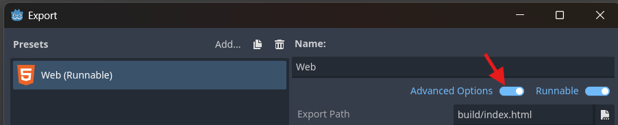
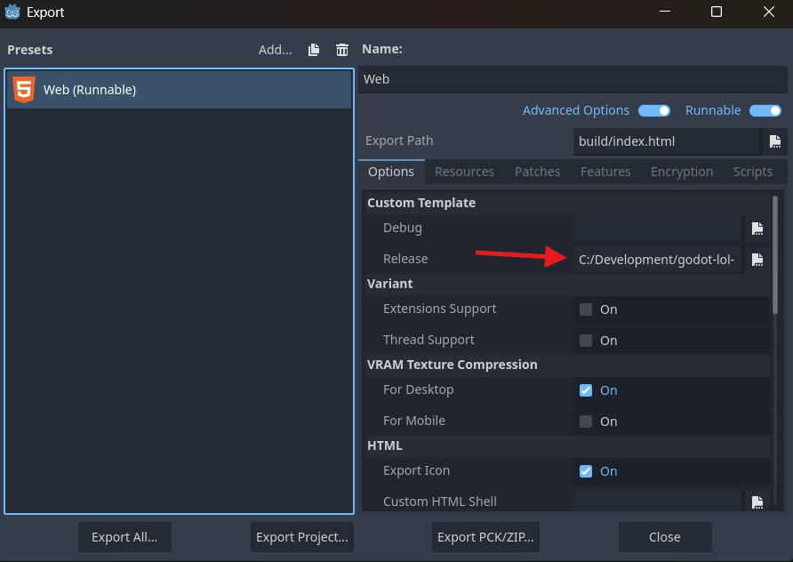

# Legends of Learning - Godot web build template builder
This is a little project meant to simplify building a web build template for Godot, with games for Legends of Learning in mind.
It is meant to create a build template used to create a very small functional web build of Godot games, while still using the latest Godot version.

Currently, a practically empty Godot project (1 scene with a RichTextLabel) results in a build of 24.1MB.

Much thanks to [this guide](https://popcar.bearblog.dev/how-to-minify-godots-build-size/) and the Godot docs about [compiling for the web](https://docs.godotengine.org/en/stable/contributing/development/compiling/compiling_for_web.html) and [optimizing a build for size](https://docs.godotengine.org/en/stable/contributing/development/compiling/optimizing_for_size.html)

## Prerequisites
The following tools are required for compiling the web build template:
- Python (preferably 3.12 or higher)

## Setup
When first using this project, initialize the submodules needed for compilation:
```commandline
git submodule update --init --recursive
```

Setup a virtual environment and activate it
```commandline
python -m venv venv
.\venv\bin\activate
```

Install the requirements with pip
```commandline
pip install -r requirements
```

## Compiling the web build template
To compile the godot web build, first make sure you have activated your python virtual environment:
```commandline
.\venv\bin\activate
```

Then compile the godot web build template with the bat file on windows:
```commandline
python make_web_build_template.py
```

You'll find the template in the godot/bin directory

## Compiling the Godot editor
To use the web build template succesfully, its version must fully match the Godot editor version. 
It's possible to build the exact Godot editor version you need by running the following command:
```commandline
python make_editor.py
```

You'll find the editor application in the godot/bin directory

## Using the web build template
To configure your web export to point to the web build template, first enable the advanced options:


Then configure the web build template as template for your export:


Now simply export your game build, and it should result in a much smaller build.
Do keep in mind, you'll still need to optimize your game assets to fit within the limits of LoL.